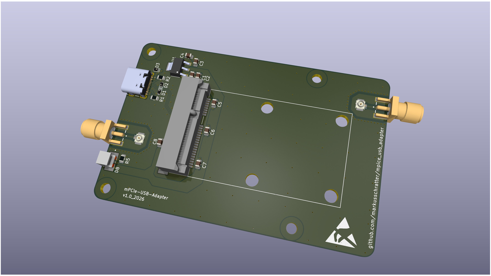

# mPCIe USB Adapter

The mPCIe USB Adapter enables connecting mPCIe modules (WiFi, Bluetooth, GNSS, etc.) to a host system via USB 2.0. The board features power regulation from 5V to 3.3V, comprehensive ESD protection on USB and signal lines, and RF connectors for antenna connections. Status LEDs provide visual feedback for power indication.

- mPCIe connector for module connection
- USB 2.0 Type-C connector for host connectivity
- 3.3V voltage regulator (LD1117S33TR) for power regulation
- ESD protection diodes for USB and signal lines
- Status LEDs (Kingbright AA4040SURSK) for power indication
- SMA connectors for RF/antenna connections
- Coaxial connectors for additional RF connections

## Overview



The mPCIe USB Adapter board allows connecting mPCIe modules (such as WiFi, Bluetooth, or GNSS modules) to a host system via USB.

| Parameter | Value |
|-----------|-------|
| Input Voltage | 5V DC (via USB) |
| Output Voltage | 3.3V DC (regulated) |
| USB Standard | USB 2.0 Type-C |
| Connector Type | mPCIe (full-size) |
| RF Connectors | 2x SMA, 2x Coaxial |

## Project Structure

```
mpcie_usb_adapter/
├── mpcie_usb_adapter.kicad_sch
├── mpcie_usb_adapter.kicad_pcb
├── mpcie_usb_adapter.kicad_pro
├── mpcie_usb_adapter.png
└── 3dmodels/                 # 3D models for components
    ├── mpcie_usb_adapter.step
    └── mpcie_usb_adapter.stl
```

## Components

| Component | Qty | Part Number | Description |
|-----------|-----|-------------|-------------|
| mPCIe Connector | 1 | [MM60-52B1-G1-R850](https://www.jae.com/de/connectors/series/detail/product/id=68908) ([Mouser](https://www.mouser.at/ProductDetail/JAE-Electronics/MM60-52B1-G1-R850?qs=LBWgzgGgPo%252BV%252BU%2FdH2aUqA%3D%3D)) | mPCIe full-size connector |
| USB Connector | 1 | [USB4105-GF-A](https://gct.co/connector/usb4105) ([Mouser](https://www.mouser.at/ProductDetail/GCT/USB4105-GF-A?qs=KUoIvG%2F9IlY%2FMLlBMpStpA%3D%3D)) | USB 2.0 Type-C connector |
| Voltage Regulator | 1 | [LD1117S33TR](https://www.st.com/resource/en/datasheet/ld1117.pdf) ([Mouser](https://www.mouser.at/ProductDetail/STMicroelectronics/LD1117S33TR?qs=edoyzKMbmhntQZx4BFmoqw%3D%3D)) | 3.3V LDO regulator |
| SMA Connector | 2 | [SMA-J-P-H-ST-EM1](https://www.samtec.com/de/products/sma-j-p-h-st-em1) ([Mouser](https://www.mouser.at/ProductDetail/Samtec/SMA-J-P-H-ST-EM1?qs=92ilVni64gwBP41DrnuA8Q%3D%3D)) | SMA RF connector (Samtec) |
| UFL Connector | 2 | [U.FL-R-SMT-110](https://4donline.ihs.com/images/VipMasterIC/IC/HIRO/HIROS10696/HIROS08829-1.pdf?hkey=CECEF36DEECDED6468708AAF2E19C0C6) ([Mouser](https://www.mouser.at/ProductDetail/Hirose-Connector/U.FL-R-SMT-110?qs=kL1ClTr6oBoOdtqlGQpQrQ%3D%3D)) | UFL coaxial RF connector (Hirose) |
| LED | 1 | [AA4040SURSK](https://www.kingbrightusa.com/images/catalog/spec/aa4040sursk.pdf) ([Mouser](https://www.mouser.com/ProductDetail/Kingbright/AA4040SURSK)) | Status LED (Kingbright) |
| ESD Protection | 2 | ESD321 | ESD protection diode |
| ESD Protection | 1 | ESD441 | ESD protection diode |
| Resistors (5.1kΩ) | 2 | R_0805_2012Metric | LED current limiting |
| Resistor (750Ω) | 1 | R_0805_2012Metric | Current limiting |
| Capacitors (100nF) | 6 | C_0805_2012Metric | Decoupling capacitors |
| Capacitors (10µF) | 2 | C_0805_2012Metric | Filtering capacitors |

## Design Files

All design files are in KiCad 9.0 format (`.kicad_sch`, `.kicad_pcb`, `.kicad_pro`). 3D STEP and STL models of the board and components are included in the `3dmodels/` directory.

**3D Board Models:**
- [STEP file](3dmodels/mpcie_usb_adapter.step) - 3D model for mechanical design
- [STL file](3dmodels/mpcie_usb_adapter.stl) - 3D model for 3D printing

**Assembly Notes**: Ensure proper ESD handling during assembly, verify LED polarity, use appropriate USB cable specifications, follow RF connector assembly guidelines.

## Acknowledgments

Thanks to **Matteo Valentini** for review and modifications.

## License

Licensed under the Apache License, Version 2.0. See [LICENSE](LICENSE) file for details.

## Contributing

Contributions are welcome! Please feel free to submit issues or pull requests.
